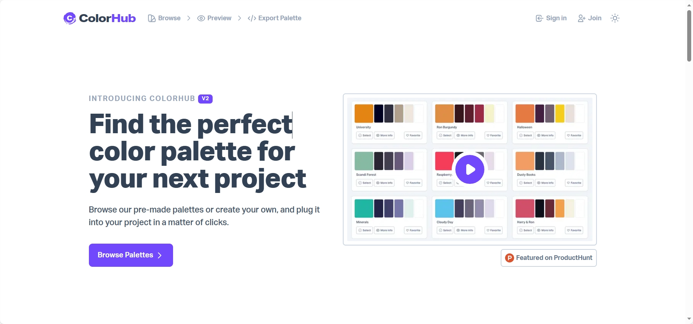
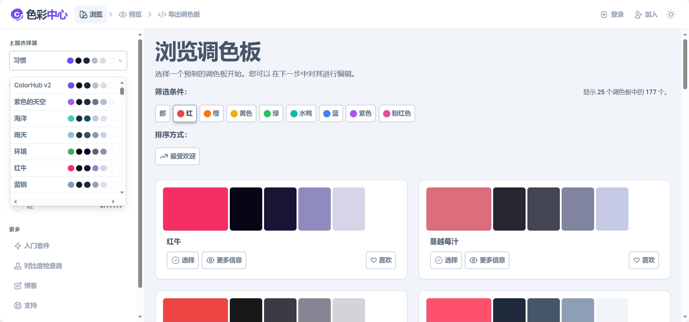

* 包含177种配色方案
* 可复制HEX或RGB值
* 可直接复制代码给前端使用（CSS/SCSS/Tailwind）
* 预览配色方案前端使用效果

如何搭配色彩往往是设计师们头疼的问题之一，许多人会从自己收藏的色卡中汲取灵感，今天给大家分享一个在线调色板Colorhub，你可以快速创建各种风格和主题的配色方案，看到不同色彩搭配所产生的效果，众多的配色方案或许还可以激发你的创作灵感。

 

Colorhub目前包含177种配色方案，可以根据需要对色板颜色直接进行更改，色板的色值也可以直接复制，HEX或RGB值均可。如果有喜欢的配色方案登录后可以收藏，避免找不到或弄错的尴尬。

该网站对前端工程师也十分友好，可以直接复制代码粘贴使用，并且支持CSS/SCSS/Tailwind三种方案。使用该功能需要登录，不过同样免费，实属良心。

## Colorhub网址
> 传送门：[https://www.colorhub.app/browse](https://www.colorhub.app/browse)
